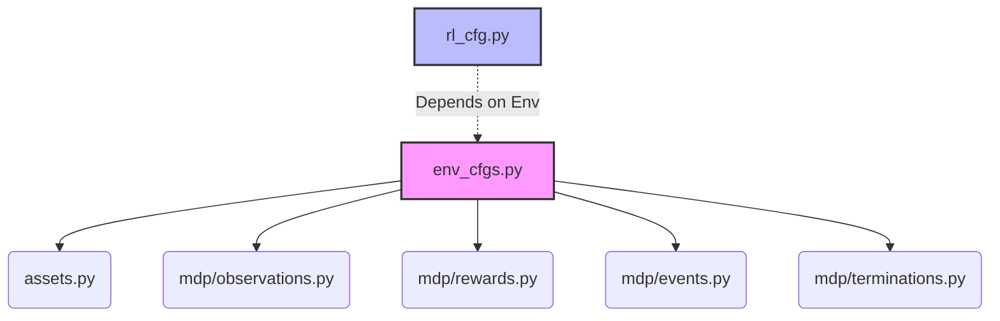

# Architecture

The `multi-robot-rl` repository utilizes a highly modular structure to decouple the functional elements of MDPs (Markov Decision Processes) from standard configuration wrappers.

## Files & Architecture

- `src/multi_robot_rl/`
    - `masspoints/` - The base folder for the dummy masspoint reaching task.
        - `env_cfgs.py` - Core configuration manager that links observations, rewards, and events into `ManagerBasedRlEnvCfg`.
        - `rl_cfg.py` - Reinforcement Learning (PPO) configuration defining network architecture and hyperparameters.
        - `assets.py` - Definitions, articulation information, and XML loaders (`masspoint.xml`, `goal.xml`).
        - `mdp/` - Module containing heavily decoupled physical logic.
            - `observations.py` - Tracks states (`root_lin_vel_w_2d`, `distance_to_goal`, `relative_goal_pos`).
            - `rewards.py` - Penalty implementations and exponential goal-reward shaping.
            - `events.py` - Environment reset and domain randomization logic.
            - `terminations.py` - Hard timeout limits and terminal state handlers.

## Dependency Graph

This diagram shows how the main environment configuration heavily aggregates modular blocks:

